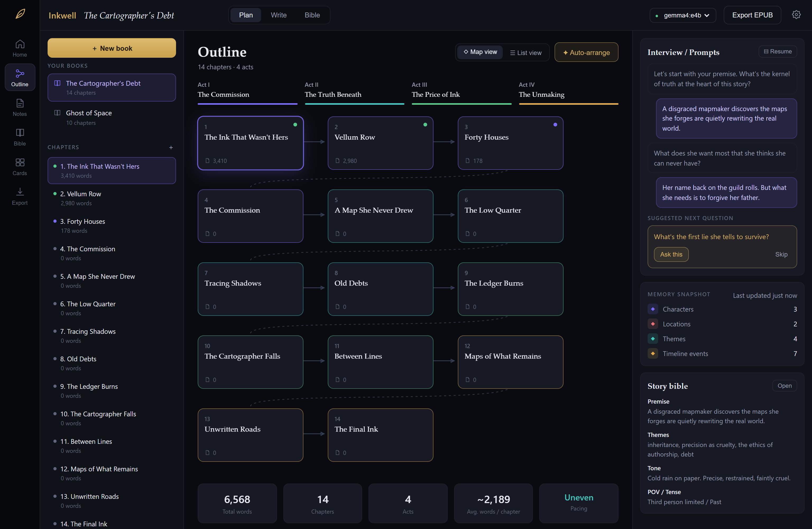
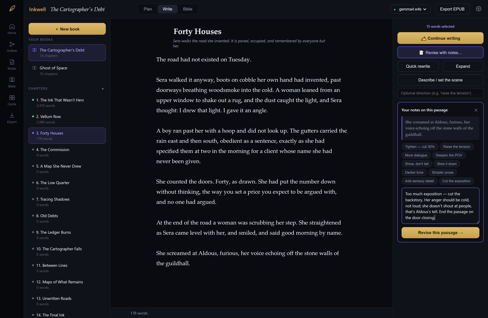
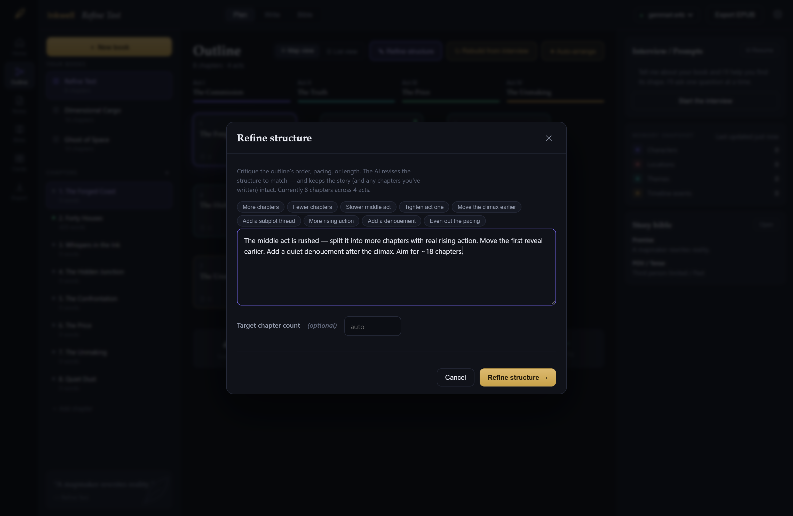

# 🖋️ Inkwell

Your own local, private AI writing studio for novels & short stories. Runs entirely
on your machine against your own [Ollama](https://ollama.com) models — no API keys,
no per-word cost, nothing leaves your computer. Exports **KDP-ready EPUB** for Kindle.

Built by **[Joshua Opel](https://github.com/joshuaopel)** at **Bowler Hat Studio**, and
given away. MIT licensed, no accounts, no paid tier, no "open core" with the good parts
behind a wall — because the tools sold to novelists are rented, metered, and pointed at
someone else's server, and they shouldn't be.

Built as a smarter, personal alternative to Sudowrite. The difference is the
**scaffolding around the model**:

- **Plan mode** — a real conversation. Inkwell asks **one question at a time**, each
  written from everything you've already told it, and suggests the next one so you can
  **Ask this** or **Skip**. The transcript is saved, so you can leave and resume.
  When you're ready it builds a four-act outline **and** a story bible from the transcript.
- **Outline map** — your book as a node graph. Chapters are cards coloured by act,
  wired in reading order, and **draggable** (positions persist to disk). Toggle to
  **List view** for summaries and beats, or **Auto-arrange** to reset the layout.
  A live stats bar tracks total words, acts, average chapter length and pacing.
- **Workspace shell** — icon rail for Home / Outline / Notes / Bible / Cards / Export,
  a book-and-chapter sidebar, and a context panel showing the interview, a **memory
  snapshot** (characters, locations, themes, timeline) and a story-bible peek.
- **Anti-amnesia context engine** — every generation is assembled from three layers:
  the whole-book synopsis + running summary, the current chapter's beats, and the
  immediate paragraphs. It never loses the thread.
- **Story Bible** — characters, locations, themes, style. The single source of truth
  the AI is checked against so the story stays consistent.
- **Notes → revise → iterate** — select any passage, write real editorial notes on it
  ("cut the exposition, make her anger cold not loud, end on the door closing"), and get
  it rewritten. Not happy? Hit **More notes ↻** and give feedback on the revision itself —
  it keeps the original, its last attempt, and your new notes in view. Ten one-click
  preset notes (Tighten, Raise the tension, Deepen the POV…) for speed. Ctrl+Enter sends.
- **Edit-alongside, diff-first** — every rewrite shows as an inline word-level diff you
  accept/reject, like a code review for prose. You stay in control of your voice.
  Passages are replaced by exact offsets, and seams are cleaned automatically so a
  mid-sentence revision never leaves duplicated words or stray punctuation.
- **Refine the structure with notes** — critique the whole outline ("the middle act is
  rushed, split it"; "move the reveal earlier"; "aim for 18 chapters") and get a revised
  outline with a **before/after preview** (new / moved / kept chapters colour-coded).
  Or **Rebuild from interview** to fold newer answers into the whole plan. Both preserve
  any chapters you've already written.
- **Talk to it, out loud** — answer interview questions by speaking instead of typing, which
  is where thin answers come from. The transcript lands in the box as editable text, and gets
  checked against your story bible so *"Marin Veil in Sable Port"* becomes **Maren Vale in
  Sableport** — matched on sound, not spelling, with every correction shown and undoable.
  Inkwell also **reads your prose back to you**, tracking the selection as it goes, which is
  the fastest way to hear a clunky sentence. Both directions are on-device only: it uses your
  system's local voices, and it refuses to dictate at all rather than stream your voice to
  someone's server.
- **Pages — see the printed book** — every chapter laid out as real pages at a real
  trim size, paginated by the browser itself, so what you see is what prints. Choose the
  trim (5×8 up to 8.5×11), the margins, the typeface, the size and leading, justification,
  drop caps, chapter openers, running heads, page numbers, scene-break ornaments and the
  colour of the paper. Six named looks (Classic literary, Modern minimal, Dark academia,
  Pulp paperback, Illustrated, Submission manuscript) to start from, or ask your local
  model to **design the book for you** from its genre and tone. Facing-page spreads on a
  desktop, one page and a swipe on a phone, and **Print → PDF** at the exact trim size.
- **Art on the page, with the text wrapping around it** — drop an image onto the page,
  pin it to a paragraph, and choose how the prose flows around it: a box, a circle, an
  oval, or **the artwork's own outline**, traced from the transparent edges of a PNG so
  the text hugs the shape itself. Captions, frames, tilt, bleeds. Upload a font file and
  it's used on the page and embedded in the EPUB.
- **Works from your phone** — icon rail becomes a tab bar, panels become drawers, the
  outline map takes touch. Run it on your desktop and open it from anywhere on your
  network (see *Reading & writing from your phone* below).
- **Everything is a file** — each book is a folder of Markdown + JSON on disk.
  Portable, backup-able, git-able.

## The guide

There's a full illustrated guide — how the interview works, how the memory engine keeps
your book straight, how to control the model's creativity, how to set up Ollama and pick
a model, and how to write from your phone.

- **Online:** <https://joshuaopel.github.io/inkwell/>
- **Offline:** click the **?** in Inkwell's top bar (`http://localhost:4321/guide.html`)

It lives at [`index.html`](index.html) in the repo root — one file, which is both
the published site and the page the app serves.

It ships inside the app and uses no webfonts or CDNs, so like everything else here it
works with the network unplugged.

## Screenshots

The outline as a draggable, act-coloured node map, with a live interview panel and memory snapshot:



Give a passage editorial notes and get a diff you accept or reject — a code review for prose:



Critique the whole structure and preview the revision before applying it:



## Requirements

- [Node.js](https://nodejs.org) 18+
- [Ollama](https://ollama.com) running locally, with at least one model pulled.

Small models (like `qwen2.5:3b`) work for testing the flow, but for real prose pull
something bigger:

```bash
ollama pull llama3.1:8b
ollama pull qwen2.5:14b
ollama pull mistral-nemo
```

## Run

```bash
npm install
npm start
```

Then open **http://localhost:4321**. Pick your model in the top-right, create a book,
and start in Plan mode.

## Reading & writing from your phone

Inkwell listens on every network interface, so once it's running on your desktop it's
already reachable from anything else on the same Wi-Fi. On startup it prints the address
to use:

```
  Inkwell  ·  your local AI writing studio
  ▸ http://localhost:4321
  ▸ http://192.168.1.24:4321   ← from your phone, on the same network
```

Open that second URL on your phone or tablet and you get the whole studio: the outline
map (drag chapters with a finger), the editor, the AI panel as a bottom sheet, and the
Pages view one page at a time — swipe left and right to turn pages. Add it to your home
screen and it runs full-screen like an app.

Only the machine running Inkwell needs Ollama; your phone just talks to Inkwell. Nothing
leaves your network either way.

Two things worth knowing:

- **Anyone on your network can reach it.** There's no login — it's a personal tool, and
  it assumes your LAN is yours. On a shared or public network, restrict it with
  `INKWELL_HOST=127.0.0.1 npm start`, which goes back to this-machine-only.
- **Firewalls.** macOS and Windows may ask to allow incoming connections the first time.
  Say yes, or the phone won't find it.

## Designing the page

The **Pages** tab in the rail shows your book as it will actually be printed, not as a
text box. Pagination is done by the browser's own layout engine at the real trim size, so
line breaks, justification, drop caps and text wrapping around art are the genuine
article — the same engine that draws the PDF.

- **Design panel** — trim size and margins (inner margin is the binding edge), typeface,
  size in points, leading, letter-spacing, justification and hyphenation, first-line
  indent, paragraph spacing, drop caps / raised caps / small caps, chapter-opener style
  and numbering (Chapter I / 1 / One), ornaments, running heads, page numbers, scene-break
  glyphs, paper tint, ink colour and texture. Every control previews live.
- **Let the model design it** — hands your genre, tone and themes to the same local model
  that writes your prose and gets back a full design plus a sentence on why. Its answer is
  validated against the catalogue, so a small model can't produce a broken page; anything
  it gets wrong falls back to the named look it was aiming at. Everything stays editable.
- **Art** — drag an image onto the page, or add it from the Art panel. Pick a side, a
  width, and how the text should wrap: box, circle, oval, or the artwork's own outline.
  Click any paragraph to move the picture there. Captions and frames optional.
- **Print / PDF** — prints at the chosen trim with the chosen type. Use your system print
  dialog's "Save as PDF". Running heads and folios are drawn by Inkwell on screen but left
  to the printer for PDFs, so a printed page won't show them.

Your design lives in `design.json` next to the book, and art in `assets/` — so a book
folder still holds everything.

## Where your work lives

```
Inkwell/books/<book-id>/
  book.json      title, author, premise, POV, tense
  bible.json     characters, locations, themes, tone, style, running summary
  outline.json   acts + chapter structure + map positions
  plan.json      the interview transcript (so Plan mode can resume)
  notes.md       freeform project notes
  design.json    trim size, margins, typography, page furniture
  art.json       where each picture sits in the prose
  assets/        the images and fonts you've uploaded
  chapters/*.md  your actual prose
```

Books created before the outline-map rewrite still open fine — they inherit the
default four acts and auto-arrange on first view.

Back this folder up and you've backed up everything.

## Cloud models (optional, and deliberately second)

Some machines genuinely can't run a model — a locked-down work laptop, an 8 GB
Chromebook, a tablet. For those, Settings → **Where the model runs** takes an API key
and adds those models to the picker under a **Cloud · billed per word** heading, so
it's always obvious which one costs money.

- **OpenAI-compatible** — OpenAI itself, or point the base URL at OpenRouter, Groq,
  Together, LM Studio, llama.cpp… anything speaking the same API.
- **Anthropic** — Claude models, direct.

Everything else is unchanged: same interview, same three-layer memory, same diff gate,
same EPUB. You can switch between a local and a cloud model mid-chapter.

Your key is written to `settings.json` on your machine (already git-ignored) and is
**never sent back to the browser** — the UI is only told whether one is set. Cloud
streaming is translated into the same wire format Ollama uses, so the rest of the app
can't tell the difference.

If you can run a model at home, run it at home. The cloud path re-introduces both
things this project exists to avoid: a meter, and your manuscript leaving your machine.

The provider layer lives in `lib/ollama.js` — adding another service means one more
entry with the same `{ listModels, chatOnce, chatStream, health }` shape.

## Settings

The gear icon opens a settings panel, saved to `settings.json` beside the `books/`
folder (not in browser storage, so it survives cache clears):

- **Model & generation** — default model, temperature, top-p, repeat penalty,
  context window, response length. These are passed straight to Ollama.
- **What the model is told** — how many words of surrounding prose to send, and
  whether to include the story bible and the running summary. Trim these if
  generations feel slow; everything here goes on *every* request. **Keep the summary
  current automatically** folds each chapter into the running "story so far" when you
  leave it, so the whole-book memory layer never goes stale (the Bible tab has a
  manual ↻ for catching up an older book).
- **Editor** — font size, line height, line width (in characters), spellcheck.
  Sliders preview live as you drag them.
- **Connection** — Ollama host, status, and a model refresh.

- **Voice** — which on-device voice reads to you, how fast, whether interview questions are
  read automatically, and whether dictation is corrected against the story bible. Dictation
  needs a browser that can transcribe on-device (Chrome or Edge today); reading aloud works
  everywhere. Inkwell will tell you which you've got.

Page design is per-book rather than global, and lives in the Pages tab.

## Config

Environment variables (all optional):

- `PORT` — web server port (default `4321`)
- `INKWELL_HOST` — interface to bind (default `0.0.0.0`, i.e. reachable from your
  network; set `127.0.0.1` to keep it on this machine only)
- `OLLAMA_HOST` — Ollama URL (default `http://localhost:11434`)
- `INKWELL_BOOKS` — where books are stored (default `./books`)
